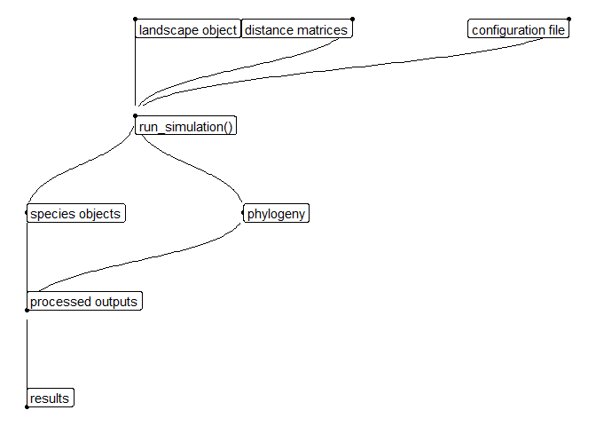

# Gen3sis Sandbox


This repository aims to serve as a data and code package for getting
started with gen3sis (Hagen et al. (2021)). There are other resources
available online, so please make sure to have a look around!

- Gen3sis workshop materials using a dynamic island landscape.  
  <https://github.com/ohagen/gen3sis_yomos_2024>

- Gen3sis wiki page - this includes a tutorial on how to set up a
  gen3sis project.  
  <https://gitlab.ethz.ch/ele-public/gen3sis_wiki/-/wikis/home>

For this tutorial, we will use some modified gen3sis data and code for
the marine environment, taken from Keggin et al. (2023). The data and
code can both be directly accessed on
[figshare](https://doi.org/10.6084/m9.figshare.24548971.v2).

Before reading through this tutorial, please have at least a skim
through the original publication, Hagen et al. (2021), and familiarise
yourself with the structure of the model, the general functions, and
their order of operations. It saves me time retyping information here,
and saves you time by not getting lost later!

## Repository structure

### Input

We are using a very coarse resolution representation of shallow water
marine reefs. The processing steps to get these data were complex and
the external data quite large, so we are skipping over these steps. We
start here with the pre-formatted landscape object and distance
matrices.

This directory contains the model inputs:

- **landscape.rds**: this is a list of xy data frames containing the
  environmental variables for each time step.

- **distance_matrices_full**: the geographic distances between each
  habitable cell - computed from the landscape (seascape) object.

### Output

This folder contains all the outputs from the model. In this case, we
have just one simulation, but we could have many, so we have a directory
for the outputs of each simulation. These are flexible, but the core
outputs include:

- **Species**: directory containing the species objects (.rds) for each
  time step. Each one is a list of species, containing:

  - **id** - species ID

  - **abundance** - vector of abundances in occupied cells

  - **traits** - data frame of traits for each occupied cell

  - **divergence** - list containing two compression objects for the
    cell-to-cell divergence values between occupied cells

- **Configuration.R**: a copy of the configuration file for that
  simulation.

- **Starting_ranges.pdf**: plot of the species ranges at the start of
  the simulation.

- **Starting_richness.pdf**: plot of the species richness at the start
  of the simulation.

# Running Gen3sis

## Setting up a simulation

The workflow is:

1.  Wrangle your environmental inputs
    1.  landscape object
    2.  distance matrices
2.  Configure your simulation using a configuration object
3.  Run your simulation
4.  Process your outputs
5.  Analyse your outputs



### 1. Environmental Inputs

Every gen3sis simulation requires two environmental inputs:

- **Landscape object**

- **Distance matrices**

It’s up to the user to wrangle whatever data they need for their project
into a gen3sis-friendly format. I find it more transparent to do this
manually. But, it is possible to use the `create_input_landscape()`
function to both convert a list of named rasters into a landscape object
and to calculate the distance matrices.

#### Landscape Object

Here, we are using a subset of the seascapes from Keggin et al. (2023)
focussing on the Caribbean. In this case, our environment consists of
**sea surface temperature (SST)** and **depth** estimates every 177 ka
from ~ 8 mya until the present at a 1 degree resolution. This gives us
48 time steps. These are stored in a list of two data frames: with xy
columns for the coordinates, and 48 columns containing the SST and depth
values for each time step.

``` r
landscapes <-
  readRDS("./input/seascapes/landscapes.rds")
```

List of two data frames,

``` r
summary(landscapes)
```

          Length Class      Mode
    temp  50     data.frame list
    depth 50     data.frame list

each containing xy coordinates and SST and depth values for each time
step, respectively.

``` r
landscapes$temp[195:205,1:5]
```

            x    y     0.00     0.17     0.33
    195 -61.5 32.5 11.38155 9.586186 11.26449
    196 -60.5 32.5 11.37058 9.528822 11.25352
    197 -59.5 32.5 11.35991 9.473370 11.24312
    198 -58.5 32.5 11.35122 9.428858 11.23469
    199 -57.5 32.5 11.34893 9.399522 11.23231
    200 -56.5 32.5 11.34543 9.383520 11.22910
    201 -55.5 32.5 11.34375 9.383630 11.22757
    202 -54.5 32.5 11.34299 9.388492 11.22697
    203 -53.5 32.5 11.34710 9.401965 11.23105
    204 -52.5 32.5 11.35305 9.402008 11.23679
    205 -51.5 32.5 11.35838 9.386295 11.24198

``` r
landscapes$depth[195:205,1:5]
```

            x    y      0.00      0.17      0.33
    195 -61.5 32.5 -4622.063 -4622.063 -4614.520
    196 -60.5 32.5 -4841.228 -4841.228 -4839.463
    197 -59.5 32.5 -5156.545 -5156.545 -5141.230
    198 -58.5 32.5 -5012.069 -5012.069 -4993.921
    199 -57.5 32.5 -5192.654 -5192.654 -5182.131
    200 -56.5 32.5 -5546.500 -5546.500 -5546.185
    201 -55.5 32.5 -5548.954 -5548.954 -5543.018
    202 -54.5 32.5 -5537.394 -5537.394 -5538.879
    203 -53.5 32.5 -5576.964 -5576.964 -5560.791
    204 -52.5 32.5 -5428.391 -5428.391 -5385.652
    205 -51.5 32.5 -5313.924 -5313.924 -5288.278

> **Important!**
>
> There are some funky quirks to abide by:
>
> - Columns must be named.
>
> - Columns must be in the order: $x,y,t_n,t_{n-1},t_{n-2}...t_0$. I.e.,
>   x and y columns, then from the most recent timestep into the past.
>
> - Row names must be assigned non-automatically. This is a
>   characteristic of base R whereby row names assigned automatically
>   can change as you manipulate the data frame, whereas if you assign
>   them manually they will persist. It is very sneaky and annoying.

#### Distance matrices

These can be either **local** or **full**. Local are compressed into a
sparse matrix and must be decompressed as the simulation runs,
increasing CPU usage. Full are uncompressed, taking up more storage, but
less CPU resources.

The data here are **full**. The row and column names correspond to the
row names (think of them as cell IDs) in the landscapes data frames.
Remember to manually assign

``` r
distance_matrix <-
  readRDS("./input/seascapes/distances_full/distances_full_0.rds")

round(distance_matrix[1:10,1:10],0)
```

         1   2   3   4   5   6   7   8   9  10
    1    0  86 172 258 344 430 516 602 688 774
    2   86   0  86 172 258 344 430 516 602 688
    3  172  86   0  86 172 258 344 430 516 602
    4  258 172  86   0  86 172 258 344 430 516
    5  344 258 172  86   0  86 172 258 344 430
    6  430 344 258 172  86   0  86 172 258 344
    7  516 430 344 258 172  86   0  86 172 258
    8  602 516 430 344 258 172  86   0  86 172
    9  688 602 516 430 344 258 172  86   0  86
    10 774 688 602 516 430 344 258 172  86   0

### 2. Configuration

Once you have your environment set up, we can think about how we’d like
to populate the simulation with species and determine how they will
behave. This is done through a configuration object. This configuration
object (and the gen3sis package in general) is incredibly flexible and
can incorporate a lot of information depending on your project. This is
not necessary though, and we can run a basic simulation using a
bare-bones configuration to get started.

The configuration object is generated by feeding a configuration file
into the `gen3sis::create_input_config()` function.

The follow steps generates a configuration file, and then reads it back
in to create the configuration object. I like to think of the
configuration in sections:

1.  General settings
2.  Initialisation
3.  Gen3sis functions
    1.  Dispersal
    2.  Speciation
    3.  Evolution
    4.  Ecology

Let’s start with a print out of a configuration file (.R script), then
work our way through each section.

#### General settings

There are some general variables across the simulation:

- **random_seed**: set the seed to control for stochastic functions

- **start_time**: specify the starting time step

- **end_time**: specify when the simulation should end

- **max_number_of_species**: global species limit

- **max_number_of_coexisting_species**: local species limit

- **trait_names: specify the traits you would like your species to
  have!**

  - To keep it simple we will include 3 traits describing the
    relationship between our species and the environment.

    - thermal optimum and standard deviation - more on the thermal
      response later!

    - depth limit: a hard cut off beyond which our species cannot
      survive.

- **environmental_ranges**: scaling options of environmental values in
  the landscape object

- **end_of_timestep_observer: a flexible function that allows you to
  save values in the environment at the end of each time step. Very
  useful!**

  - In this instance we will save species richness per cell, and the
    species object at each time step.

``` r
# set the random seed for the simulation
random_seed = 42

# set the starting time step or leave NA to use the earliest/highest timestep
start_time = NA

# set the end time step or leave as NA to use the lates/lowest timestep (0)
end_time = NA

# maximum total number of species in the simulation before it is aborted
max_number_of_species = 1000

# maximum number of species within one cell before the simulation is aborted
max_number_of_coexisting_species = 100

# a list of traits to include with each species
trait_names = c("thermal_optimum",
                "thermal_standard_deviation",
                "depth_limit")

# ranges to scale the input environments with:
# not listed variable:         no scaling takes place
# listed, set to NA:           the environmental variable will be scaled from [min, max] to [0, 1]
# listed with a given range r: the environmental variable will be scaled from [r1, r2] to [0, 1]
environmental_ranges = list()

# a place to inspect the internal state of the simulation and collect additional information if desired
end_of_timestep_observer = function(data, vars, config){
  save_richness()
  save_species()
}
```

#### Initialisation

This part took me the longest time to figure out. It determines the
starting conditions of your simulation and is very flexible!

- **initial_abundance**: the starting abundance for both newly colonised
  cells and those occupied at the beginning of the simulation.

- **create_ancestor_species**: this is a function that determines the
  starting species in the simulation.

  - Inputs: landscape (SST and depth) and a configuration object

  - Output: a species object (list of all extinct and extant species in
    a simulation).

The initial_abundance variable I hope is straightforward, but the
function can be confusing. The `gen3sis::create_input_config()` function
is reading through the configuration file and slowly building a
configuration object. The `gen3sis::create_ancestor_species()` function
reads in the landscape object (so we can use it to determine where our
species go) and the partially constructed configuration object
(`config`). The output is the species object which is first read into
the simulation.

> Remember! `gen3sis::create_ancestor_species()` is a custom function,
> we can set up our species however we like - ultimately, the species
> object is just a nested list (we will visualise it below).

We will keep our initialisation as simple as possible without being (I
hope) too boring. Let’s start with two imaginary species: a shallow
water specialist in the Atlantic (*Pisces atlanticus*), and a
depth-generalist in the Pacific (*Pisces pacificus)*. To make it
interesting, we can make the Atlantic depth specialist a temperature
generalist, and the Pacific depth generalist a temperature specialist.

To make things easier, we are going to use the
`gen3sis::create_species()` function to generate the two species. I know
this is confusing - scroll down for clarification!

``` r
# species starting in the Atlantic, limited by depth
Pa_start_cells <-
  landscapes$depth |>
  as_tibble(rownames = "cell") |>
  filter(x > -88,x < -84, y > 20, `7.83` > -1000) |>
  pull(cell)

# species starting in the Pacific, not limited by depth
Pp_start_cells <-
  landscapes$depth |>
  as_tibble(rownames = "cell") |>
  filter(x > -88,x < -84, y < 10) |>
  pull(cell)

# Initialisation ---------------------------------------------------------------
# the initial abundance of a newly colonized cell, both during setup and later when colonizing a cell during the dispersal
initial_abundance = 0.1

# place species within simulation:
create_ancestor_species <- function(landscape, config) {
  
  #browser()
  
  # Remember, the species object is just a list!
  species_object <- list()
  
  # create the Atlantic species
  species_object[[1]] <-
    gen3sis::create_species(initial_cells = Pa_start_cells,
                            config = config)
  
  # generate mean thermal niche and standard deviation
    species_object[[1]]$traits[,"thermal_optimum"] <-
      
    
    species_object[[1]]$traits[,"thermal_standard_deviation"] <-
      0.5
    
    # depth trait
    species_object[[1]]$traits[ , "depth_limit"]   <- -10000
  
  # create Pacific species
  species_object[[2]] <-
    gen3sis::create_species(initial_cells = Pp_start_cells,
                            config = config)
  
  # output species object
  return(species_object)
  
}
```

# References

<div id="refs" class="references csl-bib-body hanging-indent"
entry-spacing="0">

<div id="ref-hagen2021" class="csl-entry">

Hagen, O., B. Fluck, F. Fopp, J. S. Cabral, F. Hartig, M. Pontarp, T. F.
Rangel, and L. Pellissier. 2021. “Gen3sis: A General Engine for
Eco-Evolutionary Simulations of the Processes That Shape Earth’s
Biodiversity.” *PLOS Biology* 19 (7): 31.
<https://doi.org/10.1371/journal.pbio.3001340>.

</div>

<div id="ref-keggin2023" class="csl-entry">

Keggin, Thomas, Conor Waldock, Alexander Skeels, Oskar Hagen, Camille
Albouy, Stéphanie Manel, and Loïc Pellissier. 2023. “Diversity Across
Organisational Scale Emerges Through Dispersal Ability and Speciation
Dynamics in Tropical Fish.” *BMC Biology* 21 (1): 282.
<https://doi.org/10.1186/s12915-023-01771-3>.

</div>

</div>
