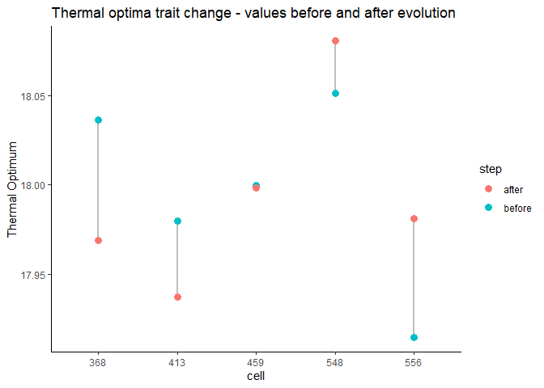
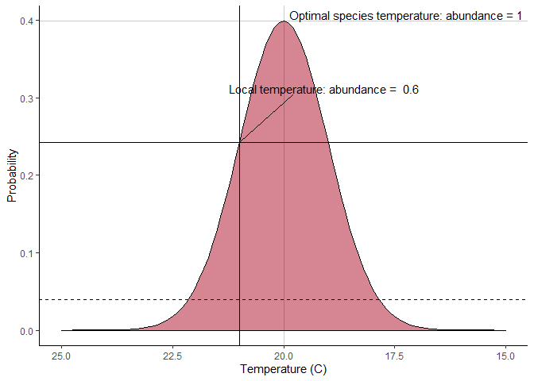

# Gen3sis Sandbox
Thomas Keggin

This repository aims to serve as a data and code package for getting
started with gen3sis (Hagen et al. (2021)). There are other resources
available online, so please make sure to have a look around!

- Gen3sis workshop materials using a dynamic island landscape.  
  <https://github.com/ohagen/gen3sis_yomos_2024>

- Gen3sis wiki page - this includes a tutorial on how to set up a
  gen3sis project.  
  <https://gitlab.ethz.ch/ele-public/gen3sis_wiki/-/wikis/home>

For this tutorial, we will use some modified gen3sis data and code for
the marine environment, taken from Keggin et al. (2023). The data and
code can both be directly accessed on
[figshare](https://doi.org/10.6084/m9.figshare.24548971.v2).

Before reading through this tutorial, please check out Hagen et al.
(2021), and familiarise yourself with the structure of the model, the
general functions, and their order of operations. It saves me time
retyping information here, and saves you time by not getting lost later!

Otherwise, perhaps these figures from the paper will jog your memory:

Overview of the simulation framework:

[](https://doi.org/10.1371/journal.pbio.3001340)

Overview of a possible study design:

[](https://doi.org/10.1371/journal.pbio.3001340)

# Running Gen3sis

I like to split the workflow into the following steps:

1.  Wrangle your environmental inputs
    1.  landscape object
    2.  distance matrices
2.  Configure your simulation
3.  Run your simulation
4.  Process your outputs
5.  Analyse your outputs

## 1. Wrangle your environmental inputs

Every gen3sis simulation requires two environmental inputs:

- **Landscape object**

- **Distance matrices**

It’s up to the user to wrangle whatever data they need for their project
into a gen3sis-friendly format. I find it more transparent to do this
manually, using the gdistance package (Etten (2017)) for the distance
matrices. But, it is possible to use the `create_input_landscape()`
function to convert a list of named rasters into both the landscape
object and distance matrices.

This process can be complex, so here we are using pre-compiled inputs
from Keggin et al. (2023), but subset to the Caribbean.

Our environment consists of **sea surface temperature (SST)** and
**depth** estimates every 177 ka from ~ 8 mya until the present at a 1
degree resolution. This gives us 48 time steps. These are stored in the
landscapes.rds object, which is a list of two data frames. Each data
frame consists of xy columns for the coordinates, and 48 columns
containing the SST and depth values for each time step.

To allow species to disperse across the landscape (seascape here), we
also have a distance matrix for each time step which defines the
geographical distance between every pair of marine cells.

> If you’re going to manually set up your landscape object and distance
> matrices, make sure to follow the file structure and file naming
> convention - check it out here: `./inputs/seascapes/`.

Let’s have a look these objects.

### Landscape Object

``` r
landscapes <-
  readRDS("./input/seascapes/landscapes.rds")
```

List of two data frames,

``` r
str(landscapes,
    max.level = 1)
```

    List of 2
     $ temp :'data.frame':  1399 obs. of  50 variables:
     $ depth:'data.frame':  1399 obs. of  50 variables:

each containing xy coordinates and SST and depth values for each time
step, respectively.

``` r
knitr::kable(round(landscapes$temp[1:5,1:10],0))
```

|   x |   y | 0.00 | 0.17 | 0.33 | 0.50 | 0.67 | 0.83 | 1.00 | 1.17 |
|----:|----:|-----:|-----:|-----:|-----:|-----:|-----:|-----:|-----:|
| -74 |  40 |    8 |   -4 |    8 |   -3 |    8 |    1 |    7 |    1 |
| -72 |  40 |    8 |   -3 |    8 |   -2 |    8 |    1 |    7 |    2 |
| -72 |  40 |    8 |   -2 |    8 |   -1 |    8 |    2 |    7 |    2 |
| -70 |  40 |    8 |   -1 |    8 |    0 |    8 |    2 |    7 |    3 |
| -70 |  40 |    8 |    0 |    8 |    0 |    8 |    3 |    7 |    3 |

``` r
knitr::kable(round(landscapes$depth[1:5,1:10],0))
```

|   x |   y |  0.00 |  0.17 |  0.33 |  0.50 |  0.67 |  0.83 |  1.00 |  1.17 |
|----:|----:|------:|------:|------:|------:|------:|------:|------:|------:|
| -74 |  40 |  -162 |  -162 |  -156 |  -143 |  -134 |  -117 |   -93 |   -78 |
| -72 |  40 |  -691 |  -691 |  -704 |  -730 |  -734 |  -669 |  -536 |  -451 |
| -72 |  40 | -1379 | -1379 | -1440 | -1562 | -1605 | -1513 | -1286 | -1195 |
| -70 |  40 | -2103 | -2103 | -2093 | -2072 | -2013 | -1945 | -1867 | -1854 |
| -70 |  40 | -2316 | -2316 | -2315 | -2315 | -2269 | -2212 | -2145 | -2114 |

Importantly, row names in these data frames are used to index cells in
the simulation - they correspond to row and column names in the distance
matrices, and information in the species objects. It is important that
these are coherent across your objects - and that you assign them
manually/non-automatically.

We can plot these out to see how they correspond to our seascape at
different time steps.

``` r
# sea surface temperature
temp_long <-
  landscapes$temp |> 
  pivot_longer(cols = !c(x,y),
               names_to = "mya",
               values_to = "SST") |> 
  mutate(mya = as.numeric(mya)) |> 
  filter(!is.na(SST),
         mya %in% c(min(mya),max(mya))) |>  
  mutate(mya = paste(mya,"mya")) 

ggplot(temp_long) +
  geom_tile(aes(x=x,y=y,fill = SST)) +
  facet_grid(~mya) +
  coord_fixed() +
  scale_fill_viridis() +
  xlab("")+ylab("") +
  ggtitle("Sea Surface Temperature (C)") +
  theme_minimal()
```


``` r
# depth
depth_long <-
  landscapes$depth |> 
  pivot_longer(cols = !c(x,y),
               names_to = "mya",
               values_to = "depth") |> 
  mutate(mya = as.numeric(mya)) |> 
  filter(!is.na(depth),
         mya %in% c(min(mya),max(mya)))|>  
  mutate(mya = paste(mya,"mya")) 

ggplot(depth_long) +
  geom_tile(aes(x=x,y=y,fill = depth)) +
  facet_grid(~mya) +
  coord_fixed() +
  xlab("")+ylab("") +
  ggtitle("Depth (m)") +
  theme_minimal()
```


> **Important!**
>
> There are some funky quirks to abide by:
>
> - Columns must be named.
>
> - Columns must be in the order: $x,y,t_n,t_{n-1},t_{n-2}...t_0$. I.e.,
>   x and y columns, then from the most recent time step into the past.
>
> - Row names must be assigned non-automatically. This is a
>   characteristic of base R whereby row names assigned automatically
>   can change as you manipulate the data frame, whereas if you assign
>   them manually they will persist. It is very sneaky and annoying.

### Distance matrices

These can be either **local** or **full**. Local are compressed into a
sparse matrix and must be decompressed as the simulation runs,
increasing CPU usage. Full are uncompressed, taking up more storage, but
less CPU resources.

The data here are **full**. The row and column names correspond to the
row names (think of them as cell IDs) in the landscapes data frames.
Remember to manually assign the row names!

``` r
distance_matrix <-
  readRDS("./input/seascapes/distances_full/distances_full_0.rds")

round(distance_matrix[1:10,1:10],0)
```

         1   2   3   4   5   6   7   8   9  10
    1    0  86 172 258 344 430 516 602 688 774
    2   86   0  86 172 258 344 430 516 602 688
    3  172  86   0  86 172 258 344 430 516 602
    4  258 172  86   0  86 172 258 344 430 516
    5  344 258 172  86   0  86 172 258 344 430
    6  430 344 258 172  86   0  86 172 258 344
    7  516 430 344 258 172  86   0  86 172 258
    8  602 516 430 344 258 172  86   0  86 172
    9  688 602 516 430 344 258 172  86   0  86
    10 774 688 602 516 430 344 258 172  86   0

## 2. Configuration

Once you have your environment set up, we can think about how we’d like
to populate the simulation with species and determine how they will
behave. This is done through a configuration object. This configuration
object is incredibly flexible and can incorporate a lot of complexity
depending on your project. This is not necessary though, and we can run
a basic simulation using a bare-bones configuration to get started.

The **configuration object** is generated by feeding a **configuration
file** (a .R script) into the `gen3sis::create_input_config()` function.

We have a pre-made configuration file, `./input/configuration_file.R`,
that we can read in. But before we do that, let’s go through it’s
contents, section by section.

1.  General settings
2.  Initialisation
3.  Gen3sis functions
    1.  Dispersal
    2.  Speciation
    3.  Evolution
    4.  Ecology

### General settings

Before setting the simulation functions, we can set up some general
variables for the simulation.

- **random_seed**: set the seed to control for stochastic functions

- **start_time**: specify the starting time step

- **end_time**: specify when the simulation should end

- **max_number_of_species**: global species limit

- **max_number_of_coexisting_species**: local species limit

- **trait_names: specify the traits you would like your species to
  have!**

  - To keep it simple we will include 3 traits describing the
    relationship between our species and the environment.

    - thermal optimum and standard deviation - more on the thermal
      response later!

    - depth limit: a hard cut off beyond which our species cannot
      survive.

- **environmental_ranges**: scaling options of environmental values in
  the landscape object

- **end_of_timestep_observer: a flexible function that allows you to
  save values in the simulation environment at the end of each time
  step. Very useful!**

  - In this instance we will save species richness per cell, the species
    object, and the phylogeny at each time step.

``` r
# General settings -------------------------------------------------------------
# set the random seed for the simulation
random_seed = 42

# set the starting time step or leave NA to use the earliest/highest timestep
start_time = NA

# set the end time step or leave as NA to use the lates/lowest timestep (0)
end_time = NA

# maximum total number of species in the simulation before it is aborted
max_number_of_species = 1000

# maximum number of species within one cell before the simulation is aborted
max_number_of_coexisting_species = 100

# a list of traits to include with each species
trait_names = c("thermal_optimum",
                "thermal_standard_deviation",
                "depth_limit")

# ranges to scale the input environments with:
# not listed variable:         no scaling takes place
# listed, set to NA:           the environmental variable will be scaled from [min, max] to [0, 1]
# listed with a given range r: the environmental variable will be scaled from [r1, r2] to [0, 1]
environmental_ranges = list()

# a place to inspect the internal state of the simulation and collect additional information if desired
end_of_timestep_observer = function(data, vars, config){
  save_richness()
  save_species()
  save_phylogeny()
}
```

### Initialisation

This part took me the longest time to figure out. It determines the
starting conditions of your simulation and is very flexible!

- **initial_abundance**: the starting abundance for both newly colonised
  cells and those occupied at the beginning of the simulation.

- **create_ancestor_species**: this is a function that determines the
  starting species in the simulation.

  - Inputs: landscape (SST and depth) and a configuration object

  - Output: a species object (list of all extinct and extant species in
    a simulation).

The initial_abundance variable I hope is straightforward, but the
function can be confusing. The `gen3sis::create_input_config()` function
is reading through the configuration file and slowly building a
configuration object. The `gen3sis::create_ancestor_species()` function
reads in the landscape object (so we can use it to determine where our
species go) and the partially constructed configuration object
(`config`). The output is the species object which is first read into
the simulation.

> Remember! `gen3sis::create_ancestor_species()` is a custom function,
> we can set up our species however we like - ultimately, the species
> object is just a nested list (we will visualise it below).

We will keep our initialisation as simple as possible without being (I
hope) too boring. Let’s start with two imaginary species: one in the
Atlantic (*Pisces atlanticus*), and one the Pacific (*Pisces
pacificus)*. To make it interesting, let’s make the Atlantic species a
temperature generalist, and a depth specialist, and *vice versa* for the
Pacific species.

| species           | temperature | depth      |
|:------------------|:------------|:-----------|
| Pisces atlanticus | generalist  | specialist |
| Pisces pacificus  | specialist  | generalist |

Before we get into the function, it might be helpful to have a look at
an existing species object - the thing we are trying to create!

``` r
species_object <-
  readRDS("./output/configuration_file/species/species_t_47.rds")

str(species_object,
    max.level = 2)
```

    List of 2
     $ :List of 5
      ..$ id        : chr "1"
      ..$ abundance : Named num [1:5] 0.137 0.737 0.997 0.269 0.105
      .. ..- attr(*, "names")= chr [1:5] "368" "413" "459" "548" ...
      ..$ traits    : num [1:5, 1:4] 18 18 18 18.1 17.9 ...
      .. ..- attr(*, "dimnames")=List of 2
      ..$ divergence:List of 2
      ..$ lineage   : chr "Pisces_atlanticus"
      ..- attr(*, "class")= chr "gen3sis_species"
     $ :List of 5
      ..$ id        : chr "2"
      ..$ abundance : Named num [1:42] 0.191 0.167 0.832 0.624 0.699 ...
      .. ..- attr(*, "names")= chr [1:42] "1021" "1022" "1069" "1070" ...
      ..$ traits    : num [1:42, 1:4] 21 21 21 21 21 ...
      .. ..- attr(*, "dimnames")=List of 2
      ..$ divergence:List of 2
      ..$ lineage   : chr "Pisces_pacificus"
      ..- attr(*, "class")= chr "gen3sis_species"

As we can see, the species object is a nested list containing a sub-list
for each individual species in the simulation (extinct species will
remain in the overall species object, but with null abundance values,
etc.). For each species we have the following information:

- **id** - species ID (new species will be assigned new IDs in serial
  automatically)
- **abundance** - vector of abundances in occupied cells
- **traits** - matrix of traits for each occupied cell
- **divergence** - list containing two compression objects for the
  cell-to-cell divergence values between occupied cells
- ***lineage*** - this is a bonus variable I added just in this instance
  to tag our initial species! This does not usually exist and won’t be
  used in the simulation.

Whilst we are here, let’s also have a look at one of the trait matrices.

``` r
knitr::kable(head(species_object[[1]]$traits))
```

|     | thermal_optimum | thermal_standard_deviation | depth_limit | dispersal |
|:----|----------------:|---------------------------:|------------:|----------:|
| 368 |        18.03625 |                        0.3 |        -200 |        NA |
| 413 |        17.97982 |                        0.3 |        -200 |        NA |
| 459 |        17.99980 |                        0.3 |        -200 |        NA |
| 548 |        18.05142 |                        0.3 |        -200 |        NA |
| 556 |        17.91502 |                        0.3 |        -200 |        NA |

We can see that there is a column for each trait we specified in the
[general settings](#general-settings), plus a dispersal trait that gets
added by default. Don’t worry about the dispersal trait this time, we
won’t be using it!

Each sub-list for the individual species is a handful. To make things
easier, we can use the `gen3sis::create_species()` function to generate
each species sub-list.

Hopefully, the following function is now understandable.

``` r
# Initialisation ---------------------------------------------------------------
# the initial abundance of a newly colonized cell, both during setup and later when colonizing a cell during the dispersal
initial_abundance = 0.1

# place species within simulation:
create_ancestor_species <- function(landscape, config) {
  
  #browser()
  
  # define the starting cells for the two species --------
  # species starting in the Atlantic, limited by depth
  Pa_start_cells <-
    landscapes$depth |>
    as_tibble(rownames = "cell") |>
    filter(x > -88,x < -84, y > 20, `7.83` > -1000) |>
    pull(cell)
  
  # species starting in the Pacific, not limited by depth
  Pp_start_cells <-
    landscapes$depth |>
    as_tibble(rownames = "cell") |>
    filter(x > -88,x < -84, y < 10) |>
    pull(cell)
  
  
  # Remember, the species object is just a list!
  species_object <- list()
  
  # create the Atlantic species -----------------------------
  species_object[[1]] <-
    gen3sis::create_species(initial_cells = Pa_start_cells,
                            config = config)
  
  # assign the mean thermal niche and standard deviation
  species_object[[1]]$traits[,"thermal_optimum"] <-
    18
  
  species_object[[1]]$traits[,"thermal_standard_deviation"] <-
    0.3
  
  # assign the minimum depth tolerance
  species_object[[1]]$traits[ , "depth_limit"]   <-
    -200
  
  # tag on a species name
  species_object[[1]]$lineage <-
    "Pisces_atlanticus"
  
  # create Pacific species ----------------------------------
  species_object[[2]] <-
    gen3sis::create_species(initial_cells = Pp_start_cells,
                            config = config)
  
  # assign the mean thermal niche and standard deviation
  species_object[[2]]$traits[,"thermal_optimum"] <-
    21
  
  species_object[[2]]$traits[,"thermal_standard_deviation"] <-
    0.1
  
  # assign the minimum depth tolerance (high!)
  species_object[[2]]$traits[ , "depth_limit"]   <-
    -10000
  
  # tag on a species name
  species_object[[2]]$lineage <-
    "Pisces_pacificus"
  
  # output species object
  return(species_object)
  
}
```

### Speciation

Speciation in gen3sis is works through a discrete threshold mechanic.
The user sets a speciation threshold which acts an upper limit of
cell-to-cell differentiation within a species. Once this limit is
reached, a new species is formed.

However! How divergence is accrued between isolated cells is highly
customisable! For now, every time step at which a pair of cells are
isolated, their pairwise differentiation increases by one. For every
time step they are connected through a dispersal event, their pairwise
differentiation decreases by one.

We assign this by simply returning `1` in the `get_divergence_factor()`
function.

``` r
# Speciation -------------------------------------------------------------------
# threshold for genetic distance after which a speciation event takes place.
# speciation after every timestep : 0.9.
# we are removing the speciation dynamic by setting the threshold to infinity.
divergence_threshold = 3

# factor by which the genetic distance is increased between geographically isolated population of a species
# can also be a matrix between the different population clusters
get_divergence_factor <- function(species, cluster_indices, landscape, config) {
  
  return(1)
}
```

### Dispersal

For every pairwise cell comparison, a dispersal attempt is made. Whether
this is successful or not is determined by the `get_dispersal_values()`
function. This is also highly customisable, and can be determined by the
environmental variables and species traits. We will try to keep it
simple here, and determine each dispersal attempt by a random pick from
a skewed Weibull distribution, using the `stats::rweibull()` function.

``` r
# Dispersal --------------------------------------------------------------------
# returns n dispersal values
get_dispersal_values <- function(num_draws, species, landscape, config) {
  
  return(
    rweibull(num_draws,
             shape = 2,
             scale = 500)
  )
}
```

Which we can visualise:


### Evolution

Every time step we can change the trait values of each species, which is
also highly flexible! We will keep this simple by changing the thermal
optima of each species randomly through drawing values from a normal
distribution.

Let’s call this random, undirected phenotypic mutation - the trait does
not track the environment. But you could set it up so it does!

``` r
# Evolution --------------------------------------------------------------------
# mutate the traits of a species and return the new traits matrix
apply_evolution <- function(species, cluster_indices, landscape, config){
  
  #browser()
  
  traits <-
    species[["traits"]]
  
  traits[,"thermal_optimum"] <-
    traits[,"thermal_optimum"] + rnorm(length(traits[,"thermal_optimum"]),
                                       mean=0,
                                       sd=0.04)
  
  return(traits)
}
```



### Ecology

The most complex looking, but most intuitive function we will use! We
load in the existing abundance values for each cell in a species, modify
them, and return a new set of abundance values. How does abundance in
each cell change per time step?

In this implementation, each cell has a minimum abundance of 0, and a
maximum abundance of 1.

> A cell with an abundance of 0 at the end of this function will go
> locally extinct!

In our case we have three traits that determine the local abundance of a
species:

- Thermal optimum

- Thermal standard deviation

- Depth limit

We use the thermal optimum (mean) and standard deviation to describe a
normal distribution to act as an abundance thermal response to
temperature. As the distribution probability decays away from the mean
(thermal optimum), so does the abundance in that cell. If the resulting
abundance is below 0.1, we drive that cell to extinction.

Let’s look at an example where the environmental temperature is 21 C,
the thermal optimum is 20 C, and the standard deviation is 1 C.



More simply, the depth limit acts as a hard cut off for abundance. If
the depth of the cell is shallower than the depth limit, nothing
happens. If it is deeper, that cell is driven to extinction (abundance =
0).

``` r
# Ecology ----------------------------------------------------------------------
# called for every cell with all occuring species, this function calculates who survives in the current cells
# returns a vector of abundances
# set the abundance to 0 for every species supposed to die
apply_ecology <- function(abundance, traits, local_environment, config) {
  
  #browser()
  
  new_abundance <-
    
    # trait information
    dplyr::as_tibble(traits) |> 
    
    # environmental information
    cbind(dplyr::as_tibble(local_environment)) |> 
    
    # ecology calculations
    dplyr::mutate(
      
      # start abundance
      start_abundance = abundance, 
      
      # the distribution density if the species' niche perfectly fits the temperature
      optimal_density = dnorm(thermal_optimum,
                              mean = thermal_optimum,
                              sd = thermal_standard_deviation),
      
      # the distribution density given the distance between species niche and temperature
      species_density = dnorm(thermal_optimum,
                              mean = temp,
                              sd = thermal_standard_deviation),
      
      # determine the abundance
      end_abundance = species_density/optimal_density,
      
      # drive to (local) extinction if abundance is below 10%
      end_abundance = ifelse(end_abundance < 0.1,
                             0,
                             end_abundance),
      
      # drive to (local) extinction if the temperature is completely unsuitable
      end_abundance = ifelse(species_density == 0,
                             0,
                             end_abundance),
      
      # drive to (local) extinction if the depth is unsuitable
      end_abundance = ifelse(depth < depth_limit,
                             0,
                             end_abundance)
    ) |> 
    
    # extract end abundance only
    dplyr::pull(end_abundance)
  
  # assign cell names
  names(new_abundance) <- names(abundance)
  
  # fin
  return(new_abundance)
}
```

And that’s it! Please have a look at the full file:
`./inputs/configuration_file.R` to see the full layout.

## 3. Run the simulation

We finally have our configuration file, landscapes, and distance
matrices, and are ready run our simulation. This is done using the
`run_smulation()` function, which we can just do in the console. This
implementation shouldn’t be too heavy - give it a go yourself!

``` r
run_simulation(
  config = "./input/configuration_file.R",
  landscape = "./input/seascapes/",
  output_directory = "./output/",
  call_observer = "all",
  enable_gc = TRUE,
  verbose = 1
)
```

And that’s the bulk of it. Once you have your outputs, it’s really up to
the user to decide what they’d like to do with them. Although I’ve
continued a bit below with a quick look at the outputs we get from our
practice simulation.

> This is just the beginning - most users run batches of gen3sis
> simulations. This can be done by building a configuration file
> template and generating many parameter variants of that template. It
> is outside the scope of these run through, though.

## 4. Process outputs

The bulk of the information from the simulation is contained in the
species objects. We saved the species objects from each time step. Below
is a block of code that extracts this species information and compiles
it all into a single data frame for analysis.

``` r
# functions
dir_fun <-
  "./scripts/functions/"

for(f in list.files(dir_fun)){
  
  source(paste0(dir_fun,f))
}

# list of species objects
species_files <-
  list.files("./output/configuration_file/species/")

# container for species data frames for each time step
species_dfs <-
  vector("list",length(species_files))

# loop through species objects
for(file in 1:length(species_files)){
  
  # load in and apply species data frame function
  species_dfs[[file]] <-
    speciesDF(
      species_object = readRDS(paste0("./output/configuration_file/species/",
                                      species_files[file])))
  
  # skip all species are extinct
  if(dim(species_dfs[[file]])[1] > 0){
    
    species_dfs[[file]] <-
      species_dfs[[file]] |> 
      mutate(timestep = parse_number(species_files[file]),
             .before = 1)
  }
}

# combine data frames
metrics_cell <-
  do.call(rbind.data.frame,species_dfs) |> 
  as_tibble()

# export -----------------------------------------------------------------------
write_csv(metrics_cell,
          "./results/species_output.csv") #output
```

## 5. Analyse outputs

### Species richness through time

We can see how species richness builds until the onset of the
interglacial periods, which eventually drive both of our lineages to
extinction.

``` r
temperature <-
  landscapes$temp |>
  as_tibble(rownames = "cell") |> 
  pivot_longer(cols = c(!cell:y),
               names_to = "mya",
               values_to = "temperature") |> 
  group_by(mya) |> 
  reframe(mean_temperature = mean(temperature,na.rm=T))

depth <-
  landscapes$depth |>
  as_tibble(rownames = "cell") |> 
  pivot_longer(cols = c(!cell:y),
               names_to = "mya",
               values_to = "depth") |> 
  group_by(mya) |> 
  reframe(mean_depth = mean(depth,na.rm=T))

years_to_timesteps <-
  data.frame(mya = colnames(landscapes$depth[,-c(1:2)]),
             timestep = 0:47)

richness_v_t <-
  metrics_cell |>
  left_join(years_to_timesteps,by="timestep") |> 
  group_by(mya) |> 
  reframe(richness = length(unique(species)))

global_extinction <-
  data.frame(mya = years_to_timesteps$mya[!years_to_timesteps$mya %in% richness_v_t$mya],
             richness = 0)

richness_v_t <-
  rbind(richness_v_t,
        global_extinction)

plot_me <-
  richness_v_t |> 
  left_join(temperature,by = "mya") |> 
  left_join(depth,by = "mya") |> 
  pivot_longer(cols = c(!mya))
  

ggplot(plot_me) +
  geom_line(aes(x = mya,
                 y = value,
                group=1))+
  facet_wrap(~name,ncol = 1,scales = "free_y") +
  theme_classic() +
  theme(axis.text.x = element_text(angle = 90, vjust = 0.5, hjust=1))
```


### Species richness

We can also manipulate the landscapes and cell metrics to plot out
spatial patterns - let’s have a look at spatial patterns of species
richness at particular points in our simulation’s history.

``` r
target_step <-
  c(0,15,25,47)

ocean <-
  landscapes$depth |>
  as_tibble(rownames = "cell") |> 
  pivot_longer(cols = !c(x,y,cell),
               names_to = "mya",
               values_to = "depth") |> 
  left_join(years_to_timesteps,by = "mya")

# start richness
richness <-
  metrics_cell |> 
  group_by(timestep,cell) |> 
  reframe(richness = length(unique(species)))

plot_me <-
  left_join(ocean,richness,by = join_by(cell, timestep)) |> 
  filter(timestep %in% target_step,
         !is.na(depth))

ggplot(plot_me) +
  
  geom_tile(aes(x=x,y=y),fill = "#0487D9",alpha = .2) +
  geom_tile(aes(x=x,y=y,fill = richness)) +
  facet_wrap(~mya) +
  scale_fill_viridis_c(na.value = "transparent",end = 0.75) +
  coord_fixed() +
  theme_minimal() +
  xlab("")+ylab("")
```


### Phylogeny

We can also pull the phylogeny from the entire simulation, if we’d like
to dig into the world of *in-silico* phylogeography!

``` r
phylogeny <-
  read.nexus(paste0("./output/configuration_file/phy.nex"))

phylogeny$edge.length <-
  phylogeny$edge.length+1

plot.phylo(phylogeny,
           show.tip.label = FALSE)
```


# References

<div id="refs" class="references csl-bib-body hanging-indent"
entry-spacing="0">

<div id="ref-vanetten2017" class="csl-entry">

Etten, Jacob van. 2017. “R Package Gdistance: Distances and Routes on
Geographical Grids.” *Journal of Statistical Software* 76 (13): 1–21.
<https://doi.org/10.18637/jss.v076.i13>.

</div>

<div id="ref-hagen2021" class="csl-entry">

Hagen, O., B. Fluck, F. Fopp, J. S. Cabral, F. Hartig, M. Pontarp, T. F.
Rangel, and L. Pellissier. 2021. “Gen3sis: A General Engine for
Eco-Evolutionary Simulations of the Processes That Shape Earth’s
Biodiversity.” *PLOS Biology* 19 (7): 31.
<https://doi.org/10.1371/journal.pbio.3001340>.

</div>

<div id="ref-keggin2023" class="csl-entry">

Keggin, Thomas, Conor Waldock, Alexander Skeels, Oskar Hagen, Camille
Albouy, Stéphanie Manel, and Loïc Pellissier. 2023. “Diversity Across
Organisational Scale Emerges Through Dispersal Ability and Speciation
Dynamics in Tropical Fish.” *BMC Biology* 21 (1): 282.
<https://doi.org/10.1186/s12915-023-01771-3>.

</div>

</div>
